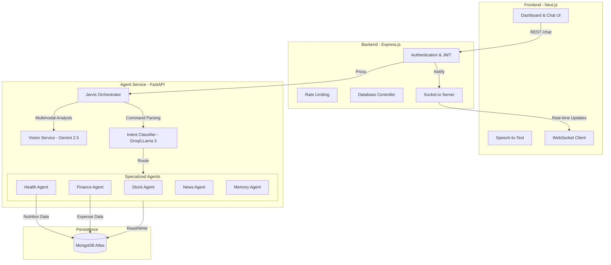

# Jarvis Technical Architecture 🏗️

This document outlines the system architecture, data flow, and API specifications for the Jarvis Personal OS.

## 📐 System Diagram

---

## 🔌 API Specifications

### 1. Backend Gateway (Express)
| Endpoint | Method | Description |
| :--- | :--- | :--- |
| `/api/auth/register` | POST | User registration & JWT generation |
| `/api/auth/login` | POST | User authentication |
| `/api/chat` | POST | Main chat endpoint (handles text & base64 images) |
| `/api/dashboard` | GET | Aggregated data for all UI widgets |
| `/api/profile/memory` | GET | Retrieve all stored personal context |

### 2. Agent Service (FastAPI)
| Endpoint | Method | Description |
| :--- | :--- | :--- |
| `/agent/chat` | POST | Receives message + image, returns AI response & actions |
| `/agent/dashboard` | GET | Returns data specifically for health/finance charts |
| `/agent/news` | GET | Fetches and summarizes latest curated news |
| `/agent/memory` | POST | Manually update user preferences/dietary info |

---

## 🧠 Multimodal Logic Flow
1. **Input:** User sends a message (e.g., "Log this pizza") + a Base64 image.
2. **Vision Pre-processing:** The `Orchestrator` detects the image and calls `VisionService`.
3. **Context Injection:** The vision description (e.g., "[IMAGE ANALYSIS: Chicken Pizza, 800 cal]") is prepended to the user's message.
4. **Intent Detection:** The `IntentClassifier` sees the injected context and routes the request to the `HealthAgent`.
5. **Action Execution:** The `HealthAgent` parses the nutrition data and saves it to MongoDB.
6. **Real-time Update:** The backend emits a WebSocket event to refresh the Frontend charts instantly.

---

## 🛠️ Technology Stack
- **Frontend:** Next.js 15, Tailwind CSS, Framer Motion, Recharts.
- **Backend:** Node.js, Express, Socket.io, MongoDB Atlas.
- **AI Intelligence:** Python 3.12, FastAPI, LangChain, Gemini 2.5 Flash, Groq, Sentence-Transformers.
- **Infrastructure:** Docker (Hugging Face Spaces), Vercel.
