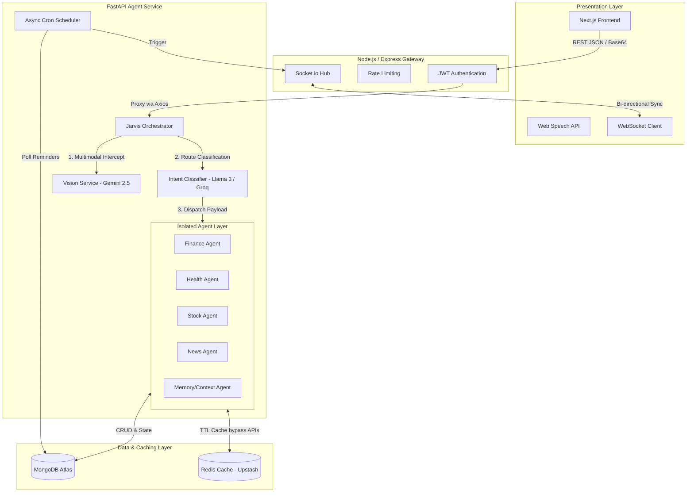
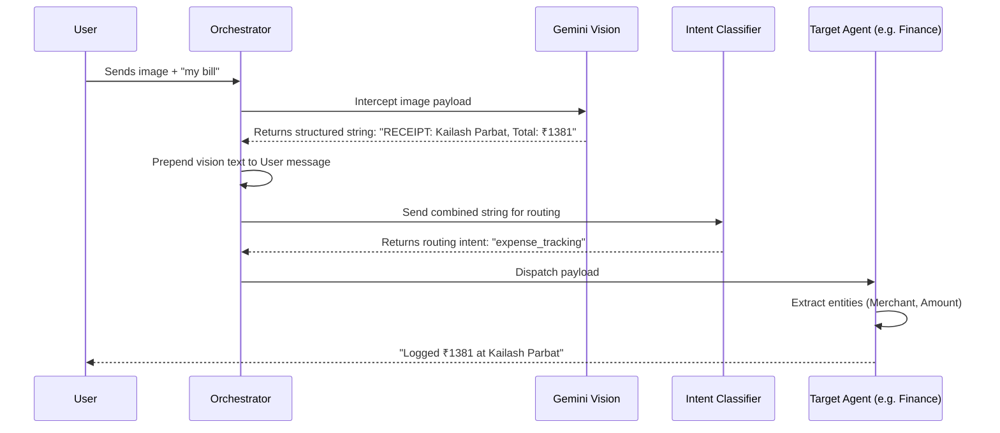

# Jarvis Technical Architecture 🏗️

This document serves as the comprehensive technical blueprint for the Jarvis Personal AI Operating System. It details the infrastructure, multi-agent orchestration patterns, distributed caching, and stateful memory mechanisms.

---

## 📐 High-Level System Architecture

The system follows a modernized decoupled microservices architecture, separating the client presentation, the backend gateway, the Python-based AI orchestration core, and the persistence/caching layer.

---

## 🔄 Logic-NLP Decoupling (Deterministic AI)

A critical design philosophy of Jarvis is **Logic-NLP Decoupling**. Large Language Models (LLMs) are notoriously bad at deterministic mathematics (e.g., calculating macronutrients or aggregating financial budgets). 

**How Jarvis solves this:**
1. **LLM as a Parser:** The LLM is strictly prompted to return structured JSON entities (e.g., `{"item": "pizza", "qty": 2}`). It is explicitly forbidden from doing math.
2. **Python as the Engine:** The FastAPI backend receives the JSON, queries the Food Database/Redis, and executes the mathematical multipliers in pure Python.
3. **Guaranteed Accuracy:** This guarantees 100% mathematical accuracy without hallucination risk.

---

## 🔀 Multimodal Data Flow (Vision -> NLP)

When a user uploads an image (e.g., a restaurant receipt or a meal), the data flows through a specialized pipeline designed to seamlessly convert unstructured visual data into structured NLP context.

---

## 💾 Caching & Infrastructure Strategy

To ensure `<100ms` response times and bypass severe rate-limiting from external APIs (Yahoo Finance, NewsAPI, Gemini Free Tier), Jarvis implements a robust **Redis Distributed Caching Layer**.

1. **News Caching:** News headlines are fetched once and cached in Redis with a 2-hour TTL. All subsequent user requests for news hit the in-memory cache instantly.
2. **Stock Caching:** Live equity quotes (e.g., Nifty 50, Reliance) are cached with a 5-minute TTL.
3. **Nutrition Caching:** Food macro estimations (which require slow LLM inferences) are cached in Redis for 30 days, dropping logging time for repeat meals from 3 seconds to 50 milliseconds.

---

## 🧠 Stateful Session Management (Clarification Loop)

Standard chatbots are stateless. Jarvis uses MongoDB to maintain **Short-Term Session State**, allowing for complex multi-turn conversations without losing context.

**Data Flow:**
1. User: *"I had some chicken."*
2. Health Agent: Realizes `qty` is missing. Halts database insertion.
3. System: Writes a `pending_action` document to MongoDB representing the frozen state.
4. System: Asks user *"How much chicken?"*
5. User: *"1 bowl."*
6. Orchestrator: Intercepts the message, checks MongoDB, finds the `pending_action`.
7. System: Re-hydrates the context: *"I had some chicken"* + *"1 bowl"* -> processes as *"I had 1 bowl of chicken"*.

---

## 🔌 Core API Specifications (FastAPI)

### Agent Orchestration
| Endpoint | Method | Payload | Description |
| :--- | :--- | :--- | :--- |
| `/agent/chat` | `POST` | `{"message": str, "image": base64, "user_id": str}` | The primary entry point. Orchestrates Vision, Intent, and Agent dispatch. |

### Dashboard Telemetry
| Endpoint | Method | Query Params | Description |
| :--- | :--- | :--- | :--- |
| `/agent/dashboard` | `GET` | `?user_id=123&date_range=this_month` | Aggregates MongoDB data via Compound Indexes for instantaneous UI hydration. |

### Live WebSockets (Socket.io / FastAPI WebSockets)
- **`connection`:** Client connects; backend registers user-specific namespace.
- **`dashboard_update`:** Pushed by the backend whenever an Agent mutates the database.
- **`reminder_alert`:** Pushed by the Python Cron Scheduler (`scheduler.py`) when a temporal deadline is reached.
- **Keep-Alive:** Implements server-side ping/pong to identify and prune ghost/stale connections, preventing memory leaks.
