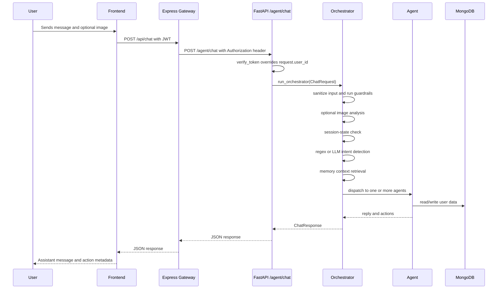
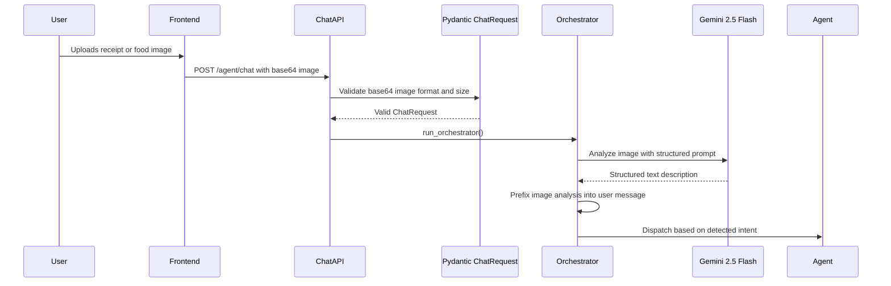
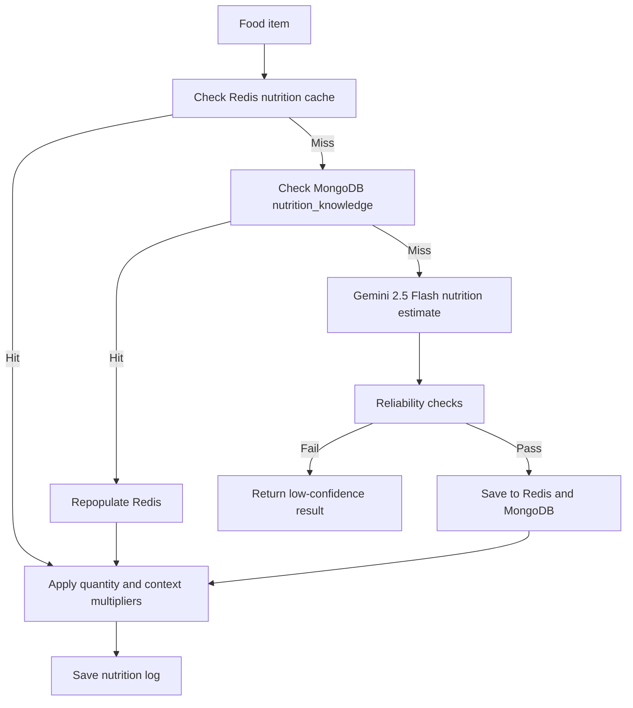
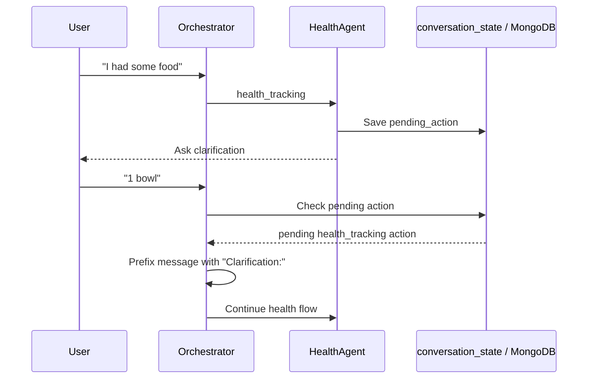

# Jarvis Architecture

Jarvis is a personal AI operating system built as a decoupled multi-service application. The current implementation is organized into three main runtime layers:

1. **Next.js frontend** for the user interface.
2. **Node.js / Express gateway** for browser-facing API routes and proxying.
3. **Python / FastAPI agent service** for authentication, AI orchestration, data processing, dashboard aggregation, WebSockets, scheduling, persistence, caching, and external API integrations.

The system uses MongoDB as the primary database, Redis as an optional cache and rate-limit backend, Groq for text LLM calls, Google Gemini for vision and nutrition estimation, NewsAPI for headlines, Yahoo Finance / mftool for market data, YouTube Data API for learning resources, and SentenceTransformers for memory embeddings.

---

## High-Level System Diagram


```mermaid
graph TD
    subgraph Frontend["Frontend - Next.js"]
        UI["App Router Pages"]
        DashboardContext["DashboardContext"]
        ChatUI["Chat Interface"]
        DashboardUI["Finance / Health / Markets / News / Profile Pages"]
        Speech["Web Speech API Hook"]
        ImageUpload["Base64 Image Upload"]
        WSClient["Browser WebSocket Client"]
        LocalStorage["localStorage: token, name, theme"]
    end

    subgraph Gateway["Node.js / Express Gateway"]
        ExpressApp["Express App"]
        ChatProxy["/api/chat and /chat"]
        DashboardProxy["/api/dashboard and /dashboard"]
        AuthProxy["/api/auth and /auth"]
        ErrorMiddleware["Error Middleware"]
    end

    subgraph AgentService["Python FastAPI Agent Service"]
        FastAPI["FastAPI App"]
        AuthRoutes["/agent/auth/register and /agent/auth/login"]
        ChatRoute["/agent/chat"]
        DashboardRoute["/agent/dashboard"]
        WebSocketRoute["/api/ws/{user_id}"]
        RateLimitMiddleware["Rate Limit Middleware"]
        Orchestrator["Jarvis Orchestrator"]
        Scheduler["APScheduler Reminder Poller"]
        Logfire["Logfire Instrumentation"]
    end

    subgraph AI["AI and Parsing Services"]
        Groq["Groq Chat Completions"]
        PromptGuard["Groq Prompt Guard Model"]
        GeminiVision["Gemini 2.5 Flash Vision"]
        GeminiNutrition["Gemini 2.5 Flash Nutrition Estimation"]
        Embeddings["SentenceTransformer all-MiniLM-L6-v2"]
    end

    subgraph Agents["Agent Layer"]
        FinanceAgent["Finance Agent"]
        HealthAgent["Health Agent"]
        NewsAgent["News Agent"]
        StockAgent["Stock Agent"]
        MemoryAgent["Memory Agent"]
        LearningAgent["Learning Agent"]
        ReminderAgent["Reminder Agent"]
    end

    subgraph Data["Persistence and Cache"]
        MongoDB["MongoDB"]
        Redis["Redis - optional"]
    end

    subgraph ExternalAPIs["External APIs"]
        NewsAPI["NewsAPI"]
        YahooFinance["Yahoo Finance / yfinance"]
        MFTool["mftool"]
        YouTube["YouTube Data API"]
    end

    UI --> DashboardContext
    ChatUI --> DashboardContext
    DashboardUI --> DashboardContext
    Speech --> ChatUI
    ImageUpload --> ChatUI
    DashboardContext --> LocalStorage

    DashboardContext --> ChatProxy
    DashboardContext --> DashboardProxy
    DashboardContext --> AuthProxy
    WSClient --> WebSocketRoute

    ChatProxy --> ChatRoute
    DashboardProxy --> DashboardRoute
    AuthProxy --> AuthRoutes

    FastAPI --> RateLimitMiddleware
    ChatRoute --> Orchestrator
    DashboardRoute --> FinanceAgent
    DashboardRoute --> HealthAgent
    DashboardRoute --> NewsAgent
    DashboardRoute --> StockAgent
    DashboardRoute --> MemoryAgent
    DashboardRoute --> ReminderAgent

    Orchestrator --> PromptGuard
    Orchestrator --> GeminiVision
    Orchestrator --> Groq
    Orchestrator --> FinanceAgent
    Orchestrator --> HealthAgent
    Orchestrator --> NewsAgent
    Orchestrator --> StockAgent
    Orchestrator --> MemoryAgent
    Orchestrator --> LearningAgent
    Orchestrator --> ReminderAgent

    FinanceAgent --> MongoDB
    HealthAgent --> MongoDB
    NewsAgent --> NewsAPI
    NewsAgent --> Redis
    StockAgent --> YahooFinance
    StockAgent --> MFTool
    MemoryAgent --> MongoDB
    MemoryAgent --> Embeddings
    LearningAgent --> YouTube
    ReminderAgent --> MongoDB
    Scheduler --> MongoDB
    Scheduler --> WebSocketRoute

    HealthAgent --> GeminiNutrition
    HealthAgent --> Redis
    HealthAgent --> MongoDB

    RateLimitMiddleware --> Redis
    RateLimitMiddleware --> MongoDB
```

---

## Repository Structure

```text
Jarvis/
├── README.md
├── ARCHITECTURE.md
├── vercel.json
├── frontend/
│   ├── app/
│   │   ├── page.tsx
│   │   ├── layout.tsx
│   │   ├── login/page.tsx
│   │   ├── register/page.tsx
│   │   ├── finance/page.tsx
│   │   ├── health/page.tsx
│   │   ├── markets/page.tsx
│   │   ├── news/page.tsx
│   │   └── profile/page.tsx
│   ├── context/DashboardContext.tsx
│   ├── hooks/useSpeechToText.ts
│   ├── components/
│   ├── lib/utils.ts
│   └── package.json
├── backend/
│   ├── index.js
│   ├── package.json
│   └── src/
│       ├── app.js
│       ├── config/env.js
│       ├── routes/
│       │   ├── auth.routes.js
│       │   ├── chat.routes.js
│       │   └── dashboard.routes.js
│       ├── controllers/
│       │   ├── chat.controller.js
│       │   └── dashboard.controller.js
│       ├── services/agent.service.js
│       └── middleware/error.middleware.js
└── agents/
    ├── main.py
    ├── requirements.txt
    ├── Dockerfile
    └── app/
        ├── api/routes/
        │   ├── auth.py
        │   ├── chat.py
        │   ├── dashboard.py
        │   └── websockets.py
        ├── agents/
        │   ├── finance_agent.py
        │   ├── health_agent.py
        │   ├── news_agent.py
        │   ├── stock_agent.py
        │   ├── memory_agent.py
        │   ├── learning_agent.py
        │   └── reminder_agent.py
        ├── core/
        │   ├── auth.py
        │   ├── config.py
        │   ├── guardrails.py
        │   ├── llm.py
        │   ├── mongodb.py
        │   ├── redis.py
        │   ├── scheduler.py
        │   ├── state.py
        │   ├── vision.py
        │   └── embeddings.py
        ├── orchestrator/jarvis_orchestrator.py
        ├── schemas/chat.py
        ├── tools/
        └── memory/
```

---

## Runtime Components

### 1. Frontend

The frontend is a Next.js application using the App Router.

Current frontend responsibilities:

- Renders the chat command center.
- Renders dashboard pages for finance, health, markets, news, and profile.
- Handles login and registration.
- Stores JWT token, user name, and theme preference in `localStorage`.
- Sends chat messages and optional base64 images to the backend gateway.
- Loads dashboard telemetry from the backend gateway.
- Maintains chat messages, live reminders, dashboard data, loading states, and errors in `DashboardContext`.
- Uses browser `WebSocket` for live reminder updates.
- Uses the Web Speech API through `useSpeechToText`.
- Uses browser `FileReader` to convert selected images into base64 data URLs.

Main files:

- `frontend/app/layout.tsx`
- `frontend/app/page.tsx`
- `frontend/context/DashboardContext.tsx`
- `frontend/hooks/useSpeechToText.ts`
- `frontend/lib/utils.ts`

The frontend calls:

```text
POST /api/auth/register
POST /api/auth/login
POST /api/chat
GET  /api/dashboard
WS   /api/ws/{user_id}?token={jwt}
```

The frontend currently sends `userId: "default-user"` in chat/dashboard requests, but the FastAPI service overrides user identity from the JWT token on protected endpoints.

---

### 2. Node.js / Express Gateway

The Node backend is a thin browser-facing gateway.

Current responsibilities:

- Starts an Express app from `backend/index.js`.
- Enables permissive CORS headers.
- Parses JSON and URL-encoded bodies up to `10mb`.
- Exposes health routes.
- Proxies chat requests to the FastAPI agent service.
- Proxies dashboard requests to the FastAPI agent service.
- Proxies auth login/register requests to the FastAPI agent service.
- Forwards the `Authorization` header to the agent service when available.

Main files:

- `backend/src/app.js`
- `backend/src/services/agent.service.js`
- `backend/src/routes/chat.routes.js`
- `backend/src/routes/dashboard.routes.js`
- `backend/src/routes/auth.routes.js`

Gateway routes:

```text
GET  /
GET  /health

POST /api/chat
POST /chat

GET  /api/dashboard
GET  /dashboard

POST /api/auth/register
POST /api/auth/login
POST /auth/register
POST /auth/login
```

The gateway uses:

```text
AGENT_SERVICE_URL=http://localhost:8000
```

by default.

Chat proxy target:

```text
POST {AGENT_SERVICE_URL}/agent/chat
```

Dashboard proxy target:

```text
GET {AGENT_SERVICE_URL}/agent/dashboard
```

Auth proxy targets:

```text
POST {AGENT_SERVICE_URL}/agent/auth/register
POST {AGENT_SERVICE_URL}/agent/auth/login
```

---

### 3. FastAPI Agent Service

The Python service is the main application backend.

Current responsibilities:

- Registers auth, chat, dashboard, and WebSocket routes.
- Starts APScheduler during application lifespan.
- Creates MongoDB indexes for key log collections.
- Applies CORS middleware.
- Applies rate limiting to `/agent/chat` and `/agent/dashboard`.
- Verifies JWT tokens for protected routes.
- Runs the Jarvis orchestrator.
- Aggregates dashboard data.
- Maintains native FastAPI WebSocket connections.
- Emits live reminder events.
- Uses Logfire instrumentation if configured.

Main files:

- `agents/main.py`
- `agents/app/api/routes/auth.py`
- `agents/app/api/routes/chat.py`
- `agents/app/api/routes/dashboard.py`
- `agents/app/api/routes/websockets.py`
- `agents/app/orchestrator/jarvis_orchestrator.py`

FastAPI routes:

```text
GET  /health

POST /agent/auth/register
POST /agent/auth/login

POST /agent/chat
GET  /agent/dashboard

WS   /api/ws/{user_id}?token={jwt}
```

---

## Authentication Design

Authentication is implemented in the FastAPI service.

### Registration

Endpoint:

```text
POST /agent/auth/register
```

Input:

```json
{
  "name": "User Name",
  "email": "user@example.com",
  "password": "password"
}
```

Process:

1. Check `users` collection for an existing email.
2. Hash password using `bcrypt`.
3. Insert user into MongoDB.
4. Create JWT access token with `sub` set to the inserted MongoDB user id.
5. Return token, token type, user id, and name.

### Login

Endpoint:

```text
POST /agent/auth/login
```

Process:

1. Find user by email.
2. Verify password with `bcrypt`.
3. Create JWT access token with `sub` set to the MongoDB user id.
4. Return token, token type, user id, and name.

### Token Verification

Protected FastAPI routes use:

```python
verify_token()
```

The token is decoded using:

```text
HS256
SECRET_KEY
```

The authenticated user id is taken from:

```text
JWT payload sub
```

For WebSockets, the token is passed as a query parameter and verified through:

```python
verify_token_from_query(token)
```

---

## Chat Request Flow


```mermaid
sequenceDiagram
    participant User
    participant Frontend
    participant Gateway as Express Gateway
    participant ChatAPI as FastAPI /agent/chat
    participant Orchestrator
    participant Agent
    participant MongoDB

    User->>Frontend: Sends message and optional image
    Frontend->>Gateway: POST /api/chat with JWT
    Gateway->>ChatAPI: POST /agent/chat with Authorization header
    ChatAPI->>ChatAPI: verify_token overrides request.user_id
    ChatAPI->>Orchestrator: run_orchestrator(ChatRequest)
    Orchestrator->>Orchestrator: sanitize input and run guardrails
    Orchestrator->>Orchestrator: optional image analysis
    Orchestrator->>Orchestrator: session-state check
    Orchestrator->>Orchestrator: regex or LLM intent detection
    Orchestrator->>Orchestrator: memory context retrieval
    Orchestrator->>Agent: dispatch to one or more agents
    Agent->>MongoDB: read/write user data
    Agent-->>Orchestrator: reply and actions
    Orchestrator-->>ChatAPI: ChatResponse
    ChatAPI-->>Gateway: JSON response
    Gateway-->>Frontend: JSON response
    Frontend-->>User: Assistant message and action metadata
```

Request model:

```json
{
  "user_id": "default-user",
  "message": "I spent 250 on lunch by UPI",
  "image": "data:image/jpeg;base64,..."
}
```

Response model:

```json
{
  "reply": "I logged Rs 250 in expenses...",
  "actions": [
    {
      "type": "expense_created"
    }
  ]
}
```

Important implementation detail:

- `user_id` from the request body is not trusted on `/agent/chat`.
- The route sets `request.user_id` to the user id from the JWT token.

---

## Orchestrator Design

The orchestrator is implemented in:

```text
agents/app/orchestrator/jarvis_orchestrator.py
```

The orchestrator coordinates:

1. Input sanitization.
2. Prompt-injection guardrails.
3. Optional image analysis.
4. Pending session-state rehydration.
5. Direct finance confirmation handling.
6. Regex shortcut intent detection.
7. LLM intent detection fallback.
8. Relevant memory retrieval.
9. Agent dispatch.
10. Output filtering.

### Supported Agent Intents in the Current Dispatcher

The orchestrator maps these intent strings to agents:

```text
expense_tracking      -> FinanceAgent
health_tracking       -> HealthAgent
news_summary          -> NewsAgent
stock_analysis        -> StockAgent
learning_help         -> LearningAgent
memory_management     -> MemoryAgent
reminder_management   -> ReminderAgent
```

The code contains regex shortcuts for finance, health, news, memory, stocks, learning, and reminders.

Implementation note:

- `reminder_management` is used by the regex shortcut and `agent_map`.
- The `VALID_INTENTS` set and LLM intent prompt currently do not include `reminder_management`, so reminder routing is reliable through regex but not through the LLM classifier path unless this is updated.

### Intent Detection Strategy

The orchestrator uses two strategies:

#### 1. Regex Shortcuts

Fast local regex detection is used for common messages:

- Health tracking
- Finance actions
- News
- Memory
- Stocks and markets
- Learning
- Reminders

#### 2. Groq LLM Classifier

If no shortcut matches, the orchestrator calls Groq through `generate_response()` and asks for strict JSON:

```json
{
  "intents": ["expense_tracking"]
}
```

If the LLM is unavailable or returns invalid JSON, the request returns an intent detection failure response.

---

## Guardrails and Safety Pipeline

Guardrails are implemented in:

```text
agents/app/core/guardrails.py
```

The current guardrail pipeline includes:

### 1. Input Sanitization

Function:

```python
sanitize_input(message)
```

Behavior:

- Removes null bytes and control characters.
- Collapses excessive blank lines.
- Collapses repeated spaces/tabs.
- Truncates messages over `MAX_MESSAGE_LENGTH`.

Current maximum message length:

```text
2000 characters
```

### 2. Regex Prompt-Injection Detection

Function:

```python
guardrail_regex_check(message)
```

Detects common jailbreak and exfiltration patterns, including:

- Ignore previous instructions.
- Disregard rules.
- New system prompt injection.
- DAN / jailbreak mode.
- System prompt requests.
- API key / secret exfiltration attempts.
- Special token injection.

### 3. Groq Prompt Guard Classifier

Function:

```python
classify_with_prompt_guard(message)
```

Uses the configured Groq guardrail model:

```text
meta-llama/llama-prompt-guard-2-86m
```

The guardrail is fail-safe:

- Missing Groq API key blocks the request.
- Timeout blocks the request.
- Unexpected classifier errors block the request.

### 4. Image Validation

Function:

```python
validate_image_input(base64_image)
```

Validation includes:

- Base64 size limit.
- JPEG signature.
- PNG signature.
- WEBP signature.
- GIF signature.

Current maximum base64 image length:

```text
10 MB
```

Image validation is applied in the `ChatRequest` Pydantic schema before the orchestrator receives the request.

### 5. Output Filtering

Function:

```python
filter_output(reply)
```

Behavior:

- Redacts secret-like tokens.
- Blocks suspected system-prompt leakage.
- Truncates oversized replies.

Current maximum reply length:

```text
8000 characters
```

### 6. Rate Limiting

Function:

```python
check_rate_limit(path, identity, limit, window)
```

Applied in FastAPI middleware to:

```text
/agent/chat
/agent/dashboard
```

Current limits:

```text
/agent/chat      -> 10 requests per 60 seconds
/agent/dashboard -> 30 requests per 60 seconds
```

Identity is derived from:

1. JWT `sub` if a valid bearer token exists.
2. Client IP address otherwise.

Redis is used when available. If Redis is unavailable, the service falls back to in-memory rate limiting.

---

## Multimodal Image Flow

Vision processing is implemented in:

```text
agents/app/core/vision.py
```

The orchestrator performs image analysis only when `request.image` is present.


```mermaid
sequenceDiagram
    participant User
    participant Frontend
    participant ChatAPI
    participant Schema as Pydantic ChatRequest
    participant Orchestrator
    participant Gemini as Gemini 2.5 Flash
    participant Agent

    User->>Frontend: Uploads receipt or food image
    Frontend->>ChatAPI: POST /agent/chat with base64 image
    ChatAPI->>Schema: Validate base64 image format and size
    Schema-->>ChatAPI: Valid ChatRequest
    ChatAPI->>Orchestrator: run_orchestrator()
    Orchestrator->>Gemini: Analyze image with structured prompt
    Gemini-->>Orchestrator: Structured text description
    Orchestrator->>Orchestrator: Prefix image analysis into user message
    Orchestrator->>Agent: Dispatch based on detected intent
```

The current vision prompt asks Gemini to return structured descriptions:

For receipts:

```text
RECEIPT: Merchant: <name>, Total: <amount>, Items: <items>
```

For meals:

```text
FOOD: <Meal name>, Items: <Item 1> (<portion>), <Item 2> (<portion>)
```

For other images:

```text
Brief visual description
```

The image analysis is prepended into the message as:

```text
[IMAGE ANALYSIS: ...]
User Message: ...
```

Finance parsing explicitly checks for receipt image analysis and logs it as an expense.

Health parsing checks image analysis and extracts food entities from it.

---

## Agent Layer

### Finance Agent

File:

```text
agents/app/agents/finance_agent.py
```

Primary responsibilities:

- Log expenses.
- Query expenses.
- Generate category summaries.
- Update expenses.
- Delete expenses.
- Set budgets.
- Query budgets.
- Log income.
- Query income.
- Add recurring expenses.
- Query recurring expenses.
- Create savings goals.
- Query savings goals.
- Generate monthly financial analytics.

Finance parsing is implemented in:

```text
agents/app/tools/finance_tools.py
```

Supported finance operations:

```text
log_expense
query_expenses
category_summary
update_expense
delete_expense
set_budget
query_budget
log_income
query_income
set_recurring
query_recurring
set_savings_goal
query_savings_goal
analytics
```

Finance data collections:

```text
expenses
income
budgets
recurring_expenses
savings_goals
pending_actions
```

Expense duplicate protection:

- Before inserting an expense, the agent checks for a same-user, same-amount, similar-description expense created within the last five minutes.

Finance confirmation flow:

- Update and delete operations create a pending confirmation in `pending_actions`.
- User replies like `yes`, `confirm`, `no`, or `cancel`.
- The agent either applies or cancels the pending mutation.

Implementation note:

- `FinanceAgent._analytics` is currently defined twice in the file. In Python, the second definition overrides the first.

---

### Health Agent

File:

```text
agents/app/agents/health_agent.py
```

Primary responsibilities:

- Log water.
- Query water.
- Set water goals.
- Log workouts.
- Query workouts.
- Log nutrition.
- Query nutrition.
- Set calorie/protein goals.
- Generate daily health summaries.
- Provide health dashboard data.
- Provide seven-day health trends.

Health parsing and nutrition estimation are implemented in:

```text
agents/app/tools/health_tools.py
```

Health operations:

```text
log_water
log_workout
log_nutrition
query_water
query_workouts
query_nutrition
set_water_goal
set_nutrition_goal
daily_summary
```

Health data collections:

```text
water_logs
workout_logs
nutrition_logs
nutrition_knowledge
health_goals
pending_actions
```

Nutrition estimation pipeline:


```mermaid
graph TD
    Item["Food item"] --> RedisCheck["Check Redis nutrition cache"]
    RedisCheck -->|Hit| ApplyQty["Apply quantity and context multipliers"]
    RedisCheck -->|Miss| MongoCheck["Check MongoDB nutrition_knowledge"]
    MongoCheck -->|Hit| RefillRedis["Repopulate Redis"]
    RefillRedis --> ApplyQty
    MongoCheck -->|Miss| Gemini["Gemini 2.5 Flash nutrition estimate"]
    Gemini --> Validate["Reliability checks"]
    Validate -->|Pass| Cache["Save to Redis and MongoDB"]
    Validate -->|Fail| Error["Return low-confidence result"]
    Cache --> ApplyQty
    ApplyQty --> Log["Save nutrition log"]
```

Nutrition cache behavior:

- Redis key format:

```text
nutrition:<normalized_food_name>
```

- Redis TTL:

```text
30 days
```

- MongoDB fallback collection:

```text
nutrition_knowledge
```

Nutrition validation checks include:

- Calories must be positive and below a maximum threshold.
- Protein must be non-negative and within expected range.
- Serving weight must be positive.
- Protein grams cannot exceed calorie-derived limits.
- Protein density cannot exceed the configured sanity threshold.

Context multiplier:

- Restaurant/outside/oily foods are multiplied for calories and fat.

---

### News Agent

File:

```text
agents/app/agents/news_agent.py
```

News tools:

```text
agents/app/tools/news_tools.py
```

Primary responsibilities:

- Fetch latest headlines.
- Detect requested category.
- Produce short headline lists.
- Produce Groq-generated summaries when requested.
- Produce daily/morning briefings across multiple categories.
- Provide dashboard news widgets.

News categories currently supported:

```text
india
world
technology
ai
business
sports
science
```

External API:

```text
NewsAPI /v2/everything
```

Caching:

- Redis is used through `cache_get` and `cache_set`.
- Cache TTL depends on category.

Current TTLs:

```text
india       -> 30 minutes
world       -> 30 minutes
technology  -> 60 minutes
ai          -> 60 minutes
business    -> 60 minutes
sports      -> 30 minutes
science     -> 120 minutes
```

---

### Stock Agent

File:

```text
agents/app/agents/stock_agent.py
```

Stock tools:

```text
agents/app/tools/stock_tools.py
```

Primary responsibilities:

- Fetch equity quotes.
- Fetch stock info.
- Fetch index snapshots.
- Compare two stocks.
- Fetch top movers.
- Fetch historical price data.
- Search mutual funds.
- Fetch mutual fund NAV.
- Compute mutual fund returns.
- Provide dashboard market indices.

External libraries/APIs:

```text
yfinance
mftool
```

Dashboard indices:

```text
Nifty 50
Sensex
Bank Nifty
```

---

### Memory Agent

File:

```text
agents/app/agents/memory_agent.py
```

Memory tools:

```text
agents/app/tools/memory_tools.py
```

Embedding service:

```text
agents/app/core/embeddings.py
```

Primary responsibilities:

- Save user facts.
- Recall user facts.
- Delete a memory.
- Clear all user memories.
- List all memories.
- Retrieve relevant context for the orchestrator.
- Provide dashboard memory summaries.

Memory collection:

```text
user_memory
```

Stored memory fields include:

```text
user_id
key
value
category
embedding
created_at
updated_at
```

Embedding model:

```text
sentence-transformers/all-MiniLM-L6-v2
```

RAG-style context retrieval:

1. Load up to 100 memory documents for the user.
2. Embed the current message.
3. Compare current-message embedding with stored memory embeddings using cosine similarity.
4. Select the top matching facts above the similarity threshold.
5. Inject relevant facts into the orchestrator context.

Current similarity threshold:

```text
0.25
```

---

### Learning Agent

File:

```text
agents/app/agents/learning_agent.py
```

Learning tools:

```text
agents/app/tools/learning_tools.py
```

Primary responsibilities:

- Search YouTube videos.
- Search YouTube playlists.
- Fetch channel/topic videos.
- Recommend courses.
- Generate learning roadmaps using Groq.
- Attach starter videos to roadmaps.

External API:

```text
YouTube Data API
```

Required environment variable:

```text
YOUTUBE_API_KEY
```

If `YOUTUBE_API_KEY` is missing, the agent returns a `learning_no_api_key` action.

---

### Reminder Agent

File:

```text
agents/app/agents/reminder_agent.py
```

Reminder tools:

```text
agents/app/tools/reminder_tools.py
```

Primary responsibilities:

- Schedule reminders.
- List active reminders.
- Cancel all pending reminders.
- Acknowledge triggered reminders.

Reminder collection:

```text
reminders
```

Reminder statuses:

```text
pending
triggered
acknowledged
cancelled
```

Reminder parsing:

- Uses Groq to extract:
  - operation
  - task
  - exact ISO-8601 execution datetime
- If no time is parsed, defaults to five minutes from now.

Fast path:

```text
acknowledge reminder <reminder_id>
```

This is used by the frontend reminder dismiss action.

---

## Stateful Session Management

Conversation state is used for multi-turn clarification flows.

The current health flow can set a pending action when clarification is required.


```mermaid
sequenceDiagram
    participant User
    participant Orchestrator
    participant HealthAgent
    participant State as conversation_state / MongoDB

    User->>Orchestrator: "I had some food"
    Orchestrator->>HealthAgent: health_tracking
    HealthAgent->>State: Save pending_action
    HealthAgent-->>User: Ask clarification
    User->>Orchestrator: "1 bowl"
    Orchestrator->>State: Check pending action
    State-->>Orchestrator: pending health_tracking action
    Orchestrator->>Orchestrator: Prefix message with "Clarification:"
    Orchestrator->>HealthAgent: Continue health flow
```

Finance also uses `pending_actions` for confirmation of update/delete operations.

---

## Dashboard Aggregation

Dashboard endpoint:

```text
GET /agent/dashboard
```

Implemented in:

```text
agents/app/api/routes/dashboard.py
```

The dashboard endpoint is protected by JWT auth. The authenticated user id comes from the token.

The endpoint aggregates:

### Finance

- Today’s expenses.
- Month expenses.
- Filtered expenses.
- Month income.
- Month net.
- Recurring monthly total.
- Category breakdown.
- Budgets with progress.
- Recent expenses.
- Savings goals.
- Recurring expenses.
- Seven-day spending trend.

### Health

- Water consumed today.
- Water goal.
- Calories today.
- Calorie goal.
- Protein today.
- Protein goal.
- Workout streak.
- Last workout.
- Seven-day health trend.

### News

- Dashboard headline groups for:
  - India
  - World
  - AI

### Memory

- Total stored memories.
- Memory groups by category.

### Stocks

- Nifty 50.
- Sensex.
- Bank Nifty.

### Reminders

- Pending reminders.
- Triggered but unacknowledged reminders.

The dashboard uses `asyncio.gather()` to run independent fetches concurrently.

Best-effort wrappers are used for:

```text
news
health
memory
stocks
reminders
```

so that one failing widget does not necessarily break the entire dashboard response.

---

## WebSocket and Reminder Scheduling

WebSockets are implemented directly in FastAPI, not Socket.io.

WebSocket file:

```text
agents/app/api/routes/websockets.py
```

Scheduler file:

```text
agents/app/core/scheduler.py
```

WebSocket endpoint:

```text
/api/ws/{user_id}?token={jwt}
```

Connection behavior:

1. Client connects with a JWT token query parameter.
2. FastAPI verifies the token.
3. The server ignores the path `user_id` for identity and uses the token subject.
4. The connection is stored in an in-memory map:

```text
user_id -> list[WebSocket]
```

Reminder scheduler behavior:

1. APScheduler runs `check_reminders()` every 10 seconds.
2. It queries MongoDB for reminders where:

```text
status = "pending"
execute_at <= now
```

3. It updates each due reminder to:

```text
status = "triggered"
```

4. It sends a WebSocket message to that reminder’s user.

Current WebSocket message shape:

```json
{
  "type": "reminder_triggered",
  "reminder": {
    "_id": "...",
    "user_id": "...",
    "task": "...",
    "execute_at": "...",
    "status": "pending",
    "created_at": "..."
  }
}
```

The scheduler also has a Hugging Face Spaces self-ping job:

```text
GET {SPACE_HOST}/health
```

It runs every four minutes when `SPACE_HOST` is configured.

Implementation note:

- The current FastAPI service exposes native WebSockets at `/api/ws/{user_id}`.
- The Express gateway does not implement WebSocket proxying in the current code.
- The frontend constructs a WebSocket URL using `API_BASE_URL.replace(/^http/, "ws") + /api/ws/default-user?token=...`.
- Deployment/local routing must ensure that this WebSocket path reaches the FastAPI service.

---

## Persistence Design

MongoDB is the source of truth for application data.

MongoDB client:

```text
agents/app/core/mongodb.py
```

Database name defaults to:

```text
jarvis
```

unless overridden by:

```text
MONGODB_DATABASE
```

Primary collections used by current code:

```text
users
expenses
income
budgets
recurring_expenses
savings_goals
water_logs
workout_logs
nutrition_logs
nutrition_knowledge
health_goals
user_memory
pending_actions
reminders
```

Indexes created during FastAPI lifespan:

```python
nutrition_logs: [("user_id", 1), ("logged_at", -1)]
water_logs:     [("user_id", 1), ("logged_at", -1)]
expenses:       [("user_id", 1), ("created_at", -1)]
```

---

## Redis Usage

Redis is optional.

Redis client:

```text
agents/app/core/redis.py
```

If `REDIS_URL` is not configured or Redis is unavailable, the app continues running with reduced caching/rate-limit durability.

Redis is used for:

1. News cache.
2. Nutrition cache.
3. Rate limiting.
4. Generic JSON cache helpers.

Redis helper functions:

```python
get_redis()
cache_get(key)
cache_set(key, data, expire_seconds)
```

Fallback behavior:

- News and nutrition simply miss cache.
- Rate limiting falls back to in-memory process-local storage.

---

## LLM and AI Services

### Groq Text LLM

Implemented in:

```text
agents/app/core/llm.py
```

Used for:

- General chat responses.
- Intent classification.
- Finance command parsing.
- Health command parsing.
- News summarization.
- Reminder time parsing.
- Learning roadmap generation.
- Memory command parsing.
- Stock command parsing.

Default model:

```text
llama-3.1-8b-instant
```

Configurable through:

```text
GROQ_MODEL
```

Default API URL:

```text
https://api.groq.com/openai/v1/chat/completions
```

### Groq Prompt Guard

Used in:

```text
agents/app/core/guardrails.py
```

Default guardrail model:

```text
meta-llama/llama-prompt-guard-2-86m
```

Configurable through:

```text
GUARDRAIL_MODEL
```

### Google Gemini Vision

Used in:

```text
agents/app/core/vision.py
```

Model:

```text
gemini-2.5-flash
```

Used for:

- Receipt image extraction.
- Meal image extraction.
- General visual description.

### Google Gemini Nutrition Estimation

Used in:

```text
agents/app/tools/health_tools.py
```

Model:

```text
gemini-2.5-flash
```

Used only after Redis and MongoDB nutrition cache misses.

### SentenceTransformer Embeddings

Used in:

```text
agents/app/core/embeddings.py
```

Model:

```text
all-MiniLM-L6-v2
```

Used for semantic memory retrieval.

---

## Environment Variables

### FastAPI Agent Service

```text
MONGODB_URI
MONGODB_DATABASE
GROQ_API_KEY
GROQ_MODEL
GROQ_API_URL
GUARDRAIL_MODEL
GOOGLE_API_KEY
GEMINI_API_KEY
NEWS_API_KEY
YOUTUBE_API_KEY
SECRET_KEY
ACCESS_TOKEN_EXPIRE_MINUTES
REDIS_URL
SPACE_HOST
```

Notes:

- `GOOGLE_API_KEY` or `GEMINI_API_KEY` can be used for Gemini.
- `SECRET_KEY` has a default fallback in code, but production should provide a strong secret.
- `REDIS_URL` is optional.
- `SPACE_HOST` is only needed for the Hugging Face self-ping behavior.

### Express Gateway

```text
PORT
AGENT_SERVICE_URL
```

Defaults:

```text
PORT=3000
AGENT_SERVICE_URL=http://localhost:8000
```

### Frontend

```text
NEXT_PUBLIC_API_BASE_URL
```

If not set, the frontend uses:

- `window.location.origin` in non-localhost browser contexts.
- `http://localhost:3000` on localhost.

---

## Deployment Configuration

The repository includes:

```text
vercel.json
```

Current configuration uses experimental services:

```json
{
  "experimentalServices": {
    "frontend": {
      "entrypoint": "frontend",
      "routePrefix": "/",
      "framework": "nextjs"
    },
    "backend": {
      "entrypoint": "backend",
      "routePrefix": "/api",
      "framework": "express"
    }
  }
}
```

The Python agent service includes:

```text
agents/Dockerfile
agents/README.md
```

The agent README is configured like a Hugging Face Space with:

```text
sdk: docker
app_port: 7860
```

---

## Local Development Flow

### 1. Start the FastAPI Agent Service

```bash
cd agents
python -m venv .venv
.venv\Scripts\activate
pip install -r requirements.txt
uvicorn main:app --reload
```

Default URL:

```text
http://localhost:8000
```

### 2. Start the Express Gateway

```bash
cd backend
npm install
npm run dev
```

Default URL:

```text
http://localhost:3000
```

### 3. Start the Next.js Frontend

```bash
cd frontend
npm install
npm run dev
```

Default URL:

```text
http://localhost:3000
```

Port note:

- The frontend and Express gateway both default to port `3000`.
- In local development, one of them must run on a different port or the frontend must call the deployed/configured gateway through `NEXT_PUBLIC_API_BASE_URL`.

---

## Known Current Implementation Notes

These are not theoretical design items; they reflect the current codebase state.

1. **Reminder intent mismatch**
   - The dispatcher supports `reminder_management`.
   - Regex routing can detect reminders.
   - The LLM intent schema currently does not list `reminder_management`.

2. **Native WebSocket implementation**
   - The code uses FastAPI native WebSockets.
   - It does not use Socket.io in the current implementation.

3. **Express gateway is mostly a proxy**
   - Auth, chat, and dashboard logic live in FastAPI.
   - Express forwards requests and authorization headers.

4. **JWT user id overrides client user id**
   - Frontend still sends `"default-user"`.
   - FastAPI protected routes use the JWT subject as the real user id.

5. **Dashboard is concurrent**
   - Independent dashboard sections are loaded using `asyncio.gather()`.

6. **Redis is optional**
   - Redis improves caching and rate limiting but is not required for the app to start.

7. **MongoDB is required for core user data**
   - Finance, health, memory, reminders, auth, and dashboard state depend on MongoDB.

8. **Finance analytics method is duplicated**
   - `FinanceAgent._analytics` appears twice.
   - Python uses the second definition.

9. **Frontend has legacy files**
   - The active UI is the Next.js `app/` implementation.
   - Some `frontend/src` service files appear to be older Vite-style leftovers.

---

## End-to-End Data Boundaries

### Trusted identity boundary

```text
JWT token -> FastAPI verify_token() -> user_id
```

The body/query `userId` is not the trusted identity for protected FastAPI routes.

### Main persistence boundary

```text
Agents -> MongoDB collections
```

Agents perform database reads/writes directly through `get_collection()`.

### AI boundary

```text
Orchestrator / tools -> Groq / Gemini
```

LLMs parse, classify, summarize, or estimate. Deterministic storage and aggregation happen in Python.

### Cache boundary

```text
Redis cache -> fallback to direct computation/API/MongoDB
```

Redis is an optimization, not the primary source of truth.

---

## Primary Request Paths

### Chat

```text
Frontend
-> Express /api/chat
-> FastAPI /agent/chat
-> verify JWT
-> guardrails
-> optional vision
-> intent detection
-> memory context
-> agent execution
-> MongoDB / Redis / external APIs
-> response
```

### Dashboard

```text
Frontend
-> Express /api/dashboard
-> FastAPI /agent/dashboard
-> verify JWT
-> concurrent aggregation
-> MongoDB / Redis / external APIs
-> response
```

### Auth

```text
Frontend
-> Express /api/auth/login or /api/auth/register
-> FastAPI /agent/auth/login or /agent/auth/register
-> MongoDB users collection
-> JWT response
```

### Reminder Trigger

```text
APScheduler
-> MongoDB reminders query
-> mark reminder triggered
-> FastAPI WebSocket manager
-> browser WebSocket client
-> live reminder UI
```