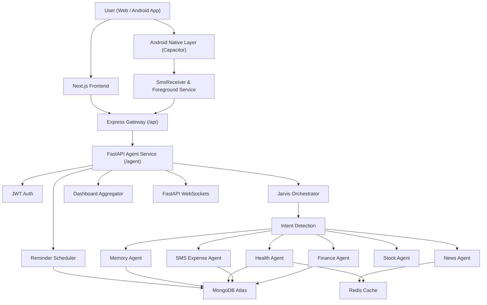

# Jarvis - Personal AI Operating System & Mobile Expense Tracker

Jarvis is a full-stack, multi-agent AI assistant and native mobile app that brings personal finance, automatic SMS expense tracking, health tracking, market intelligence, news briefings, reminders, memory, learning support, voice input, and image understanding into one conversational dashboard.

The goal of this project is simple: instead of opening different apps for expenses, calories, stocks, reminders, and notes, the user can talk to one assistant. On Android, Jarvis automatically monitors payment SMS messages in real-time (even when the app is closed) to parse, categorize, and log expenses seamlessly into your dashboard.

---

## What Jarvis Can Do

### 📱 Automatic SMS Expense Tracking (Native Android)

- **Real-Time SMS Interception**: Runs a background Android Foreground Service (`SmsListenerService`) to catch incoming payment SMS messages automatically.
- **Smart SMS Parsing**: Uses pattern matching and NLP regex to extract total amount, merchant/description (Swiggy, Amazon, Uber, Zomato, etc.), bank name (HDFC, SBI, ICICI, Axis, BOI, Kotak, Paytm, PhonePe, GPay), and payment type.
- **Background Sync**: Works seamlessly even when the app is completely closed or your phone reboots.
- **Inbox Backfill**: Automatically scans up to 50 recent inbox payment messages on initial login to catch up on untracked expenses.
- **Live Toast & Dashboard Panel**: Displays real-time toast alerts on new SMS detection and provides a dedicated **"Auto-tracked (SMS)"** panel on the Finance page with total auto-tracked calculations and hover-to-delete.

### 💬 Conversational Command Center

- Chat with Jarvis from a Next.js web dashboard or Android native app.
- Send natural language commands like:
  - `I spent 250 on lunch by UPI`
  - `Drank 2 glasses of water`
  - `Nifty 50 today`
  - `Remember I am vegetarian`
  - `Remind me to check emails at 5pm`
  - `Roadmap to learn Python`
- Upload receipt or food images and let Jarvis extract structured information.
- Use speech input through the browser Web Speech API.

### 💳 Finance Tracking

- Log expenses from natural language or automatic SMS parsing.
- Categorize expenses automatically (Food, Shopping, Bills, Travel, Health, Entertainment, etc.).
- Detect payment methods such as UPI, cash, card, bank, wallet, or unknown.
- Query expenses by date range.
- View category-wise spending.
- Track monthly income and net balance.
- Set and monitor budgets.
- Add recurring expenses.
- Create savings goals.
- Delete or update expenses through confirmation flows.
- Generate AI-powered financial analytics based on monthly spending.
- Detect possible duplicate expenses created within a short time window.

### 🏃 Health and Fitness Tracking

- Log water intake.
- Log workouts.
- Log meals and nutrition.
- Track calories, protein, fat, carbs, and hydration.
- Set water, calorie, and protein goals.
- Show daily health summaries.
- Show workout streak and latest workout.
- Generate 7-day calorie, protein, and water trends.
- Estimate food nutrition using a cache-first AI pipeline.

### 👁️ Vision-Based Automation

- Upload receipt images.
- Extract merchant, total amount, and items using Gemini Vision.
- Route receipt data to the finance agent.
- Upload food images.
- Extract food items and portions.
- Route food data to the health agent.

### 📈 Market Intelligence

- Fetch live stock quotes.
- Fetch Indian index snapshots such as Nifty 50, Sensex, and Bank Nifty.
- Compare two stocks.
- Fetch top gainers and losers.
- Fetch stock history.
- Search mutual funds.
- Fetch mutual fund NAV and returns.
- Show market widgets in the dashboard.

### 📰 News Briefings

- Fetch latest headlines from NewsAPI.
- Support India, World, Technology, AI, Business, Sports, and Science categories.
- Generate morning/daily briefings.
- Summarize headlines using an LLM when requested.
- Cache news results in Redis to reduce repeated API calls.

### 🧠 Long-Term Memory

- Save facts about the user.
- Recall saved facts.
- Delete individual memories.
- Clear all memories.
- Group memories by category.
- Use vector embeddings to retrieve relevant user context during conversations.

### 🎓 Learning Assistant

- Search YouTube learning videos.
- Find playlists.
- Recommend courses.
- Generate learning roadmaps with AI.
- Attach starter videos to learning plans.

### ⏰ Reminders and Real-Time Alerts

- Schedule reminders from natural language.
- Parse relative times like `in 10 minutes` or `tomorrow at 5pm`.
- Store reminders in MongoDB.
- Poll due reminders in the background.
- Push live reminder alerts to the frontend through native FastAPI WebSockets.
- Acknowledge or cancel reminders.

---

## Architectural Highlights

### 1. Native Android & Web Dual Architecture
The app runs both as a modern responsive Next.js web application and as a native Android app compiled via Capacitor with custom Java plugins for native SMS hardware access.

### 2. Multi-Agent AI Architecture
Jarvis uses a central orchestrator that detects intent and delegates work to specialized agents:
- Finance Agent & SMS Expense Agent
- Health Agent
- News Agent
- Stock Agent
- Memory Agent
- Learning Agent
- Reminder Agent

### 3. Deterministic Backend Logic
LLMs are used for language understanding, parsing, summarization, and extraction, while all calculations (budgets, totals, nutrition, date ranges) are handled deterministically in Python/Node.

---

## High-Level Architecture



---

## Tech Stack

### Mobile & Android Native
- **Capacitor 7** (`@capacitor/core`, `@capacitor/android`)
- **Android SDK / Java 19**
- **Custom Native Plugin** (`SmsPlugin.java` & `SmsListenerService.java`)
- **SharedPreferences** for secure token persistence

### Frontend
- Next.js 16 (Static Export for Mobile & Web)
- React 19
- TypeScript
- Tailwind CSS 4
- HeroUI & Framer Motion
- Recharts
- Web Speech API

### Node Gateway
- Node.js
- Express 5
- Native `fetch` REST proxy routes

### Python Agent Service
- FastAPI & Uvicorn
- Pydantic
- Motor async MongoDB driver
- Regex SMS Parser (`app.core.sms_parser`)
- APScheduler
- PyJWT & bcrypt
- Logfire instrumentation

---

## Core API Routes

### Express Gateway (`/api`)
```text
GET  /health
POST /api/chat
GET  /api/dashboard
POST /api/auth/register
POST /api/auth/login
POST /api/expenses/sms
GET  /api/expenses/sms
```

### FastAPI Agent Service (`/agent`)
```text
GET  /health
POST /agent/auth/register
POST /agent/auth/login
POST /agent/chat
GET  /agent/dashboard
POST /agent/expenses/sms
GET  /agent/expenses/sms
WS   /api/ws/{user_id}?token={jwt}
```

---

## Local & Mobile Setup

### 1. Clone the Repository
```bash
git clone <repository-url>
cd Jarvis
```

### 2. Start Python Agent Service
```bash
cd agents
python -m venv .venv
.venv\Scripts\activate
pip install -r requirements.txt
uvicorn main:app --reload --port 8000
```

### 3. Start Express Gateway
```bash
cd backend
npm install
npm run dev
```

### 4. Build & Sync Mobile App (Android APK)
```bash
cd frontend
npm install
npm run build
npx cap sync android
cd android
.\gradlew assembleDebug
```
*The compiled APK will be at: `frontend/android/app/build/outputs/apk/debug/app-debug.apk`*
