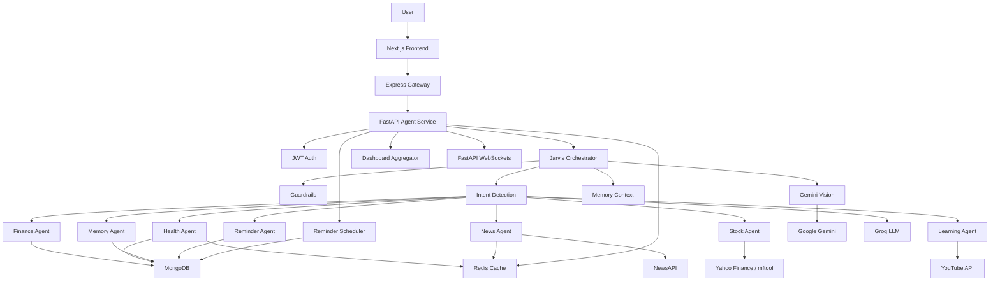

# Jarvis - Personal AI Operating System

Jarvis is a full-stack, multi-agent AI assistant that brings personal finance, health tracking, market intelligence, news briefings, reminders, memory, learning support, voice input, and image understanding into one conversational dashboard.

The goal of this project is simple: instead of opening different apps for expenses, calories, stocks, reminders, and notes, the user can talk to one assistant. Jarvis understands the request, routes it to the right specialist agent, performs deterministic backend logic, saves the result, and updates the dashboard.


---

## What Jarvis Can Do

### Conversational Command Center

- Chat with Jarvis from a Next.js dashboard.
- Send natural language commands like:
  - `I spent 250 on lunch by UPI`
  - `Drank 2 glasses of water`
  - `Nifty 50 today`
  - `Remember I am vegetarian`
  - `Remind me to check emails at 5pm`
  - `Roadmap to learn Python`
- Upload receipt or food images and let Jarvis extract structured information.
- Use speech input through the browser Web Speech API.

### Finance Tracking

- Log expenses from natural language.
- Categorize expenses automatically.
- Detect payment methods such as UPI, cash, card, bank, wallet, or unknown.
- Query expenses by date range.
- View category-wise spending.
- Track monthly income and net balance.
- Set and monitor budgets.
- Add recurring expenses.
- Create savings goals.
- Delete or update expenses through confirmation flows.
- Generate AI-powered financial analytics based on monthly spending.
- Detect possible duplicate expenses created within a short time window.

### Health and Fitness Tracking

- Log water intake.
- Log workouts.
- Log meals and nutrition.
- Track calories, protein, fat, carbs, and hydration.
- Set water, calorie, and protein goals.
- Show daily health summaries.
- Show workout streak and latest workout.
- Generate 7-day calorie, protein, and water trends.
- Estimate food nutrition using a cache-first AI pipeline.

### Vision-Based Automation

- Upload receipt images.
- Extract merchant, total amount, and items.
- Route receipt data to the finance agent.
- Upload food images.
- Extract food items and portions.
- Route food data to the health agent.

### Market Intelligence

- Fetch live stock quotes.
- Fetch Indian index snapshots such as Nifty 50, Sensex, and Bank Nifty.
- Compare two stocks.
- Fetch top gainers and losers.
- Fetch stock history.
- Search mutual funds.
- Fetch mutual fund NAV and returns.
- Show market widgets in the dashboard.

### News Briefings

- Fetch latest headlines from NewsAPI.
- Support India, World, Technology, AI, Business, Sports, and Science categories.
- Generate morning/daily briefings.
- Summarize headlines using an LLM when requested.
- Cache news results in Redis to reduce repeated API calls.

### Long-Term Memory

- Save facts about the user.
- Recall saved facts.
- Delete individual memories.
- Clear all memories.
- Group memories by category.
- Use vector embeddings to retrieve relevant user context during conversations.

### Learning Assistant

- Search YouTube learning videos.
- Find playlists.
- Recommend courses.
- Generate learning roadmaps with AI.
- Attach starter videos to learning plans.

### Reminders and Real-Time Alerts

- Schedule reminders from natural language.
- Parse relative times like `in 10 minutes` or `tomorrow at 5pm`.
- Store reminders in MongoDB.
- Poll due reminders in the background.
- Push live reminder alerts to the frontend through native FastAPI WebSockets.
- Acknowledge or cancel reminders.

---


### 1. Multi-Agent AI Architecture

Jarvis does not use one large, messy prompt for every task. It uses a central orchestrator that detects intent and delegates work to specialized agents:

- Finance Agent
- Health Agent
- News Agent
- Stock Agent
- Memory Agent
- Learning Agent
- Reminder Agent

This keeps each domain isolated, testable, and easier to extend.

### 2. Deterministic Backend Logic

LLMs are used for language understanding, parsing, summarization, and extraction. They are not trusted for important calculations or database mutations.

For example:

- Expense totals are calculated in Python.
- Budget progress is calculated in Python.
- Nutrition totals are calculated in Python.
- Date ranges are resolved in backend utilities.
- MongoDB writes are controlled by deterministic agent logic.

This avoids common AI problems such as hallucinated math or unreliable state changes.

### 3. Multimodal AI Pipeline

Jarvis supports text, voice, and images.

Images are validated first, then analyzed with Gemini 2.5 Flash. The resulting structured text is added to the user message and passed into the same agent routing pipeline. This means receipts and meal photos reuse the existing finance and health logic instead of needing separate one-off flows.

### 4. Real-Time System Design

The reminder system uses:

- MongoDB for persistence.
- APScheduler for background polling.
- FastAPI native WebSockets for live delivery.
- Frontend WebSocket client for instant UI updates.

This demonstrates real-time backend design beyond basic REST APIs.

### 5. Async Dashboard Aggregation

The dashboard pulls finance, health, memory, news, stock, and reminder data. Independent sections are loaded concurrently with `asyncio.gather()`, so slow APIs do not force the whole dashboard into a purely sequential flow.

### 6. Cache-First Infrastructure

Redis is used for:

- News caching.
- Nutrition estimate caching.
- Rate limiting.

If Redis is unavailable, the app continues running with fallback behavior.

### 7. Security and Guardrails

The FastAPI agent service includes a layered security pipeline:

- JWT authentication.
- Password hashing with bcrypt.
- Rate limiting.
- Input sanitization.
- Prompt-injection regex checks.
- Groq Prompt Guard classifier.
- Image validation.
- Output filtering and secret redaction.

---

## High-Level Architecture



---

## Tech Stack

### Frontend

- Next.js 16
- React 19
- TypeScript
- Tailwind CSS 4
- HeroUI
- Framer Motion
- Recharts
- Browser WebSocket API
- Web Speech API

### Node Gateway

- Node.js
- Express 5
- Native `fetch`
- REST proxy routes

### Python Agent Service

- FastAPI
- Uvicorn
- Pydantic
- Motor async MongoDB driver
- APScheduler
- PyJWT
- bcrypt
- httpx
- Logfire instrumentation

### AI and Data

- Groq Chat Completions
- Groq Prompt Guard
- Google Gemini 2.5 Flash
- SentenceTransformers `all-MiniLM-L6-v2`
- MongoDB Atlas
- Redis / Upstash
- NewsAPI
- yfinance
- mftool
- YouTube Data API

---

## Main Services

### Frontend

Location:

```text
frontend/
```

The frontend provides the main user interface:

- Chat command center.
- Finance dashboard.
- Health dashboard.
- Markets dashboard.
- News dashboard.
- Login and registration pages.
- Dark mode.
- Speech input.
- Image upload.
- Live reminder display.

### Express Gateway

Location:

```text
backend/
```

The Express backend is a gateway between the browser and the Python agent service.

It exposes:

```text
POST /api/chat
GET  /api/dashboard
POST /api/auth/register
POST /api/auth/login
```

and proxies them to the FastAPI service.

### FastAPI Agent Service

Location:

```text
agents/
```

The FastAPI service is the main backend brain of the project.

It handles:

- Auth
- Chat orchestration
- Agent routing
- Dashboard aggregation
- WebSockets
- Reminder scheduling
- MongoDB access
- Redis caching
- LLM calls
- Vision calls
- Guardrails

---

## Core API Routes

### Express Gateway

```text
GET  /health
POST /api/chat
GET  /api/dashboard
POST /api/auth/register
POST /api/auth/login
```

### FastAPI Agent Service

```text
GET  /health
POST /agent/auth/register
POST /agent/auth/login
POST /agent/chat
GET  /agent/dashboard
WS   /api/ws/{user_id}?token={jwt}
```

---

## Data Storage

MongoDB is the primary database.

Main collections used:

```text
users
expenses
income
budgets
recurring_expenses
savings_goals
water_logs
workout_logs
nutrition_logs
nutrition_knowledge
health_goals
user_memory
pending_actions
reminders
```

Indexes are created at startup for frequently queried collections:

```text
nutrition_logs: user_id + logged_at
water_logs: user_id + logged_at
expenses: user_id + created_at
```

---

## Environment Variables

Create an `.env` file inside `agents/`.

Required for core functionality:

```text
MONGODB_URI=
SECRET_KEY=
GROQ_API_KEY=
GOOGLE_API_KEY=
NEWS_API_KEY=
```

Optional but recommended:

```text
REDIS_URL=
YOUTUBE_API_KEY=
MONGODB_DATABASE=
GROQ_MODEL=
GROQ_API_URL=
GUARDRAIL_MODEL=
ACCESS_TOKEN_EXPIRE_MINUTES=
SPACE_HOST=
```

For the Express gateway:

```text
PORT=
AGENT_SERVICE_URL=
```

For the frontend:

```text
NEXT_PUBLIC_API_BASE_URL=
```

---

## Local Setup

### 1. Clone the Repository

```bash
git clone <repository-url>
cd Jarvis
```

### 2. Start the FastAPI Agent Service

```bash
cd agents
python -m venv .venv
.venv\Scripts\activate
pip install -r requirements.txt
uvicorn main:app --reload
```

Default URL:

```text
http://localhost:8000
```

### 3. Start the Express Gateway

```bash
cd backend
npm install
npm run dev
```

Default URL:

```text
http://localhost:3000
```

### 4. Start the Frontend

```bash
cd frontend
npm install
npm run dev
```

If the Express gateway and frontend both try to use port `3000`, run one of them on a different port and set:

```text
NEXT_PUBLIC_API_BASE_URL=<gateway-url>
```

---

## Example Commands

Finance:

```text
I spent 250 on lunch by UPI
Set food budget 5000 per month
Show my expenses this week
Delete expense id <mongo_id>
Create a savings goal of 100000 for laptop
```

Health:

```text
Drank 2 glasses of water
I ate 2 rotis and dal
Did 30 min gym
Set protein goal 150g
Health summary
```

Markets:

```text
Nifty 50 today
Reliance stock price
Compare TCS and Infosys
Top gainers today
Axis bluechip mutual fund NAV
```

News:

```text
Morning briefing
Latest AI news
Summarize technology news
```

Memory:

```text
Remember I am vegetarian
What do you know about me?
Forget my diet preference
```

Learning:

```text
Roadmap to learn Python
Best React course
Machine learning playlist
```

Reminders:

```text
Remind me to check emails at 5pm
Set a timer for 10 minutes
List reminders
Cancel reminders
```

