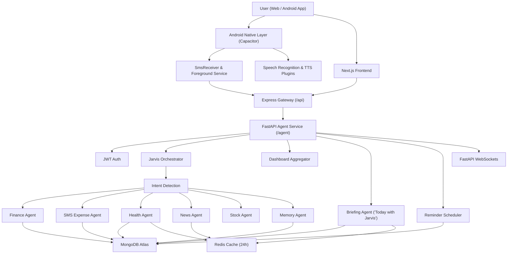

# Jarvis - Personal AI Operating System & Mobile Expense Tracker

Jarvis is a full-stack, multi-agent AI assistant and native mobile app that brings personal finance, automatic SMS expense tracking, proactive daily briefings, health tracking, market intelligence, news briefings, reminders, memory, learning support, voice input, and image understanding into one conversational dashboard.

The goal of this project is simple: instead of opening different apps for expenses, calories, stocks, reminders, and notes, the user can talk to one assistant. On Android, Jarvis automatically monitors payment SMS messages in real-time (even when the app is closed) to parse, categorize, and log expenses seamlessly into your dashboard.

---

## 🌟 Key Highlights & Capabilities

### 🌅 "Today with Jarvis" Proactive Daily Briefing
- **Cross-Domain Synthesis**: Combines financial pace (burn rate, month-end forecast, budget overruns), health tracking progress (water, calories, protein), schedule alerts/reminders, and stock market indices into a morning briefing.
- **Concrete Suggested Actions**: Generates 1–3 concrete, high-impact suggestions with 1-tap executable action buttons.
- **Audio Read-Aloud (TTS)**: Reads the briefing out loud using native Android Text-to-Speech (`@capacitor-community/text-to-speech`) and Web Speech API fallback.
- **Smart 1-Per-Day Caching**: Generates the briefing via AI at most once per calendar day per user. Results are persisted across Redis, MongoDB, and `localStorage` for instant day-long loading, automatically refreshing when the date rolls over.
- **Automated Morning Notifications**: Proactive daily push reminders to check your morning briefing.

### 📱 Automatic SMS Expense Tracking (Native Android)
- **Real-Time SMS Interception**: Runs a background Android Foreground Service (`SmsListenerService`) to catch incoming payment SMS messages automatically.
- **Smart SMS Parsing**: Uses pattern matching and NLP regex to extract total amount, merchant/description (Swiggy, Amazon, Uber, Zomato, etc.), bank name (HDFC, SBI, ICICI, Axis, BOI, Kotak, Paytm, PhonePe, GPay), and payment type.
- **Mutual-Exclusion Deduplication**: Prevents duplicate entries between the foreground JavaScript bridge and native background receiver.
- **Atomic Reference ID Protection**: Ingested SMS messages are matched against transaction Reference IDs (`sms_metadata.reference_id`) to discard duplicates at the database level.
- **1-Click Deduplication Tool**: Built-in `Clean Duplicates` button on the Finance Dashboard and `/api/expenses/deduplicate` endpoint to scan and remove duplicate entries.
- **Inbox Backfill**: Automatically scans up to 50 recent inbox payment messages on initial login to catch up on untracked expenses.
- **Live Toast & Dashboard Panel**: Displays real-time toast alerts on new SMS detection and provides a dedicated **"Auto-tracked (SMS)"** panel on the Finance page with touch-friendly controls.

### 🎙️ Native Speech Recognition & Voice Commands
- **Dual-Mode Speech-to-Text**: Uses `@capacitor-community/speech-recognition` on Android WebView for offline-capable native microphone recognition, with Web Speech API fallback for desktop browsers.
- **Accented Speech Support**: Configured for Indian English (`en-IN`) and multi-language spoken input.

### 💬 Conversational Command Center
- Chat with Jarvis from a Next.js web dashboard or Android native app.
- Send natural language commands like:
  - `Brief me on today`
  - `I spent 250 on lunch by UPI`
  - `Drank 2 glasses of water`
  - `Nifty 50 today`
  - `Remember I am vegetarian`
  - `Remind me to check emails at 5pm`
  - `Roadmap to learn Python`
- Upload receipt or food images and let Jarvis extract structured information.

### 💳 Finance Tracking
- Log expenses from natural language or automatic SMS parsing.
- Categorize expenses automatically (Food, Shopping, Bills, Travel, Health, Entertainment, etc.).
- Detect payment methods such as UPI, cash, card, bank, wallet, or unknown.
- Query expenses by date range and view category breakdowns.
- Track monthly income and net balance.
- Set and monitor budgets with projected month-end overage alerts.
- Add recurring expenses and create savings goals.
- Delete or update expenses through confirmation flows.

### 🏃 Health and Fitness Tracking
- Log water intake, workouts, and meals.
- Track calories, protein, fat, carbs, and hydration.
- Set water, calorie, and protein goals.
- Show workout streak, latest workout, and daily health summaries.
- Generate 7-day calorie, protein, and water trends.
- Estimate food nutrition using a cache-first AI pipeline with Google Gemini Vision.

### 👁️ Vision-Based Automation
- Upload receipt images to extract merchant, total amount, and items using Gemini Vision.
- Upload food images to extract dishes, estimated calories, and macros.

### 📈 Market Intelligence
- Fetch live stock quotes and Indian index snapshots (Nifty 50, Sensex, Bank Nifty).
- Compare two stocks, check top gainers/losers, and query stock histories.
- Search mutual funds and fetch mutual fund NAV and historical returns.

### 📰 News Briefings
- Fetch latest headlines from NewsAPI across India, World, Technology, AI, Business, Sports, and Science.
- Summarize headlines with Groq LLMs and cache results in Redis.

### 🧠 Long-Term Memory
- Save and recall facts about the user using vector embeddings.
- Automatically supplies relevant user preferences into the conversation context.

### ⏰ Reminders and Real-Time Alerts
- Schedule reminders from natural language (e.g. `in 10 minutes`, `tomorrow at 5pm`).
- Native FastAPI WebSockets push live alerts to the frontend when reminders are due.

---

## 🏗️ Architecture



---

## 🛠️ Tech Stack

### Mobile & Android Native
- **Capacitor 7** (`@capacitor/core`, `@capacitor/android`, `@capacitor/local-notifications`)
- **Native Audio Plugins**: `@capacitor-community/speech-recognition`, `@capacitor-community/text-to-speech`
- **Android SDK / Java 19**
- **Custom Native Plugin**: `SmsPlugin.java`, `SmsReceiver.java`, `SmsListenerService.java`
- **Permissions**: `RECEIVE_SMS`, `READ_SMS`, `RECORD_AUDIO`, `POST_NOTIFICATIONS`

### Frontend
- **Framework**: Next.js 16 (Static Export for Android & Web)
- **UI Library**: React 19, Tailwind CSS 4, HeroUI, Framer Motion
- **State & Theme**: Context API (`DashboardContext.tsx`), Dark/Light mode
- **Charts**: Recharts

### Node Gateway
- **Runtime**: Node.js & Express 5
- **Features**: Authentication pass-through, REST proxy routes, error normalizing

### Python Agent Service
- **Framework**: FastAPI & Uvicorn, Pydantic
- **Database**: Motor async MongoDB driver
- **LLMs**: Groq (`llama-3.1-8b-instant`, `openai/gpt-oss-120b`), Google Gemini Vision
- **Caching**: Upstash Redis / Redis Cloud
- **Scheduler**: APScheduler, FastAPI WebSockets

---

## 📡 API Endpoints

### Express Gateway (`/api`)
```text
GET  /health
POST /api/chat
GET  /api/dashboard
POST /api/auth/register
POST /api/auth/login
GET  /api/briefing                    # Daily briefing (Today with Jarvis)
POST /api/expenses/sms                # Ingest SMS expense
GET  /api/expenses/sms                # Get auto-tracked SMS expenses
POST /api/expenses/deduplicate        # Scan & clean duplicate expenses
```

### FastAPI Agent Service (`/agent`)
```text
GET  /health
POST /agent/auth/register
POST /agent/auth/login
POST /agent/chat
GET  /agent/dashboard
GET  /agent/briefing                  # AI Daily Briefing with 24h caching
POST /agent/expenses/sms
GET  /agent/expenses/sms
POST /agent/expenses/deduplicate      # Remove duplicate expense records
WS   /api/ws/{user_id}?token={jwt}     # Real-time reminder notifications
```

---

## 🚀 Getting Started

### 1. Clone the Repository
```bash
git clone https://github.com/mangalgithub/jarvis.git
cd Jarvis
```

### 2. Configure Environment Variables
Create `.env` inside `agents/`:
```env
MONGODB_URI=mongodb://localhost:27017
MONGODB_DATABASE=jarvis
GROQ_API_KEY=your_groq_api_key
GROQ_MODEL=openai/gpt-oss-120b
NEWS_API_KEY=your_news_api_key
YOUTUBE_API_KEY=your_youtube_api_key
GEMINI_API_KEY=your_gemini_api_key
REDIS_URL=your_redis_url
```

### 3. Run Python Agent Service
```bash
cd agents
python -m venv .venv
.venv\Scripts\activate
pip install -r requirements.txt
uvicorn main:app --reload --port 8000
```

### 4. Run Express Gateway
```bash
cd backend
npm install
npm run dev
```

### 5. Run Web Frontend
```bash
cd frontend
npm install
npm run dev
```

---

## 📱 Building the Android App

To generate and install the latest Android APK:

```powershell
# 1. Build Next.js static assets
cd frontend
npm run build

# 2. Sync web assets & native plugins to Capacitor Android
npx cap sync android

# 3. Compile Android debug APK
cd android
.\gradlew.bat assembleDebug
```

The APK will be generated at:
```
frontend/android/app/build/outputs/apk/debug/app-debug.apk
```

Install directly on your phone via ADB:
```powershell
adb install -r "frontend\android\app\build\outputs\apk\debug\app-debug.apk"
```
